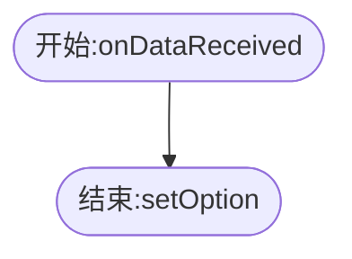
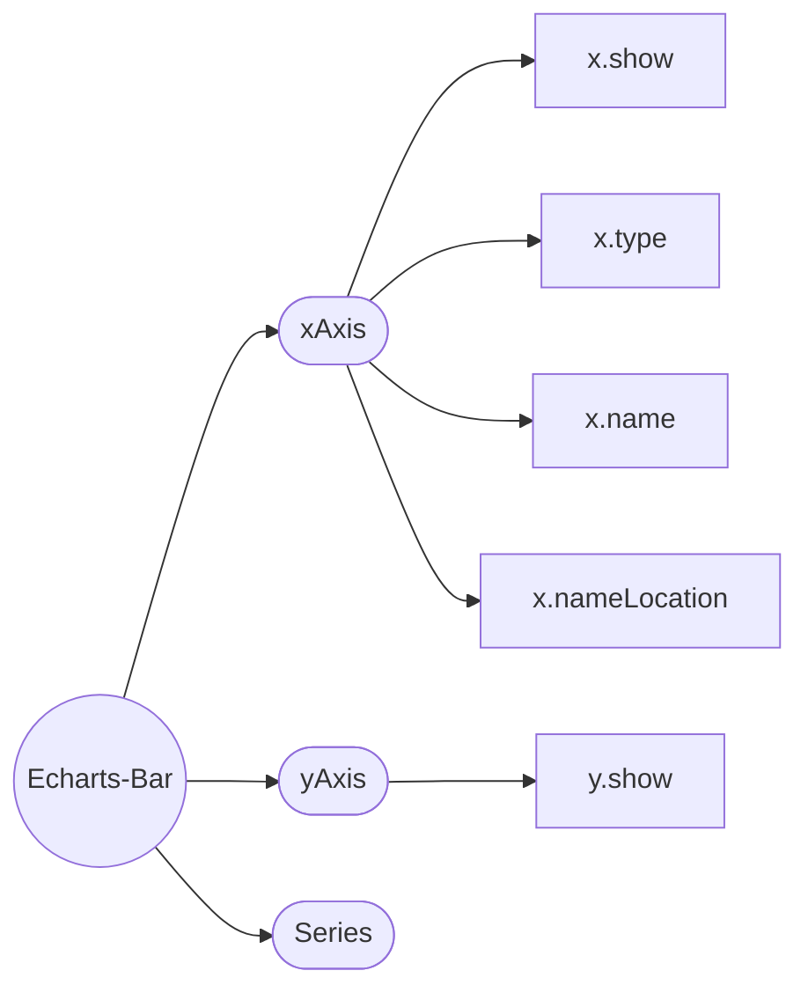
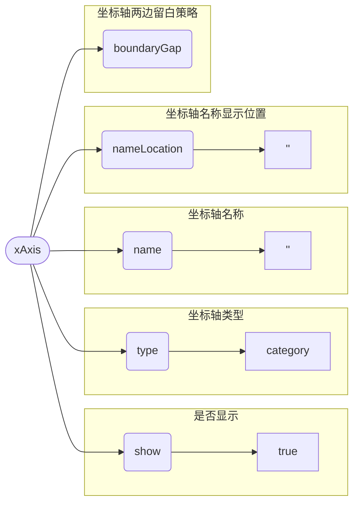
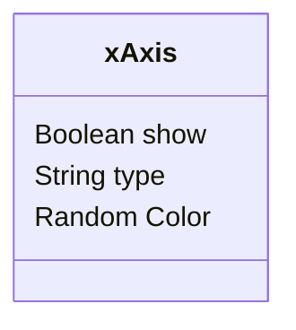

# MindMap

## Data Flow Chart

```mermaid
graph TB

st([开始:onDataReceived])
ed([结束:setOption])

st-->ed

```

## Options

```mermaid
graph LR

Main((Echarts-Bar))
x([xAxis])
y([yAxis])
s([Series])
Main-->x
    x --> x.show
    x --> x.type
    x --> x.name
    x --> x.nameLocation
Main-->y
    y --> y.show
Main-->s

```

### xAxis

```mermaid
graph LR

x([xAxis])
s(show)
t(type)
n(name)
nL(nameLocation)
bG(boundaryGap)

x --> s
    subgraph 是否显示
    s --> true
    end
x --> t
    subgraph 坐标轴类型
    t --> category
    end
x --> n
    subgraph 坐标轴名称
    n --> nDef['']
    end
x --> nL
    subgraph 坐标轴名称显示位置
    nL --> nLDef['']
    end
x --> bG
    subgraph 坐标轴两边留白策略
    bG
    end
```

```mermaid
classDiagram

class xAxis
    xAxis : Boolean show
    xAxis : String type
    xAxis : Random Color
```
